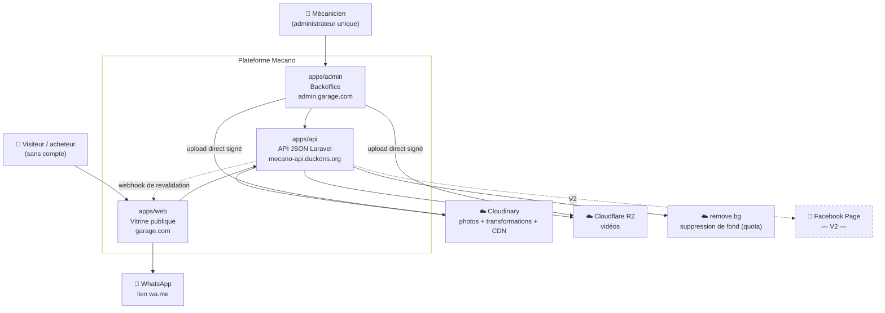
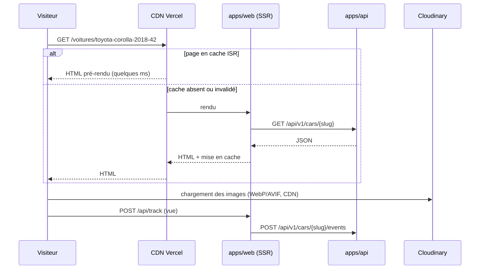
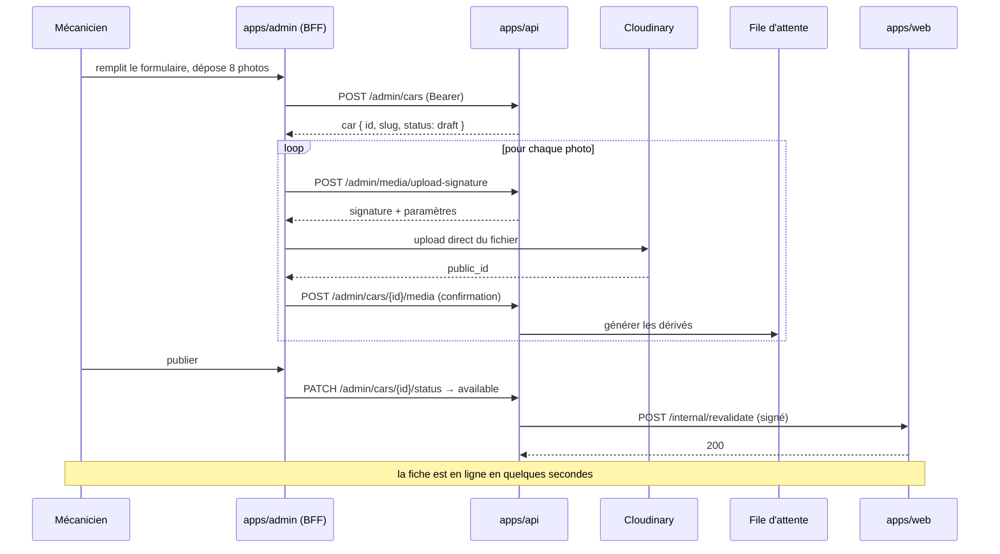
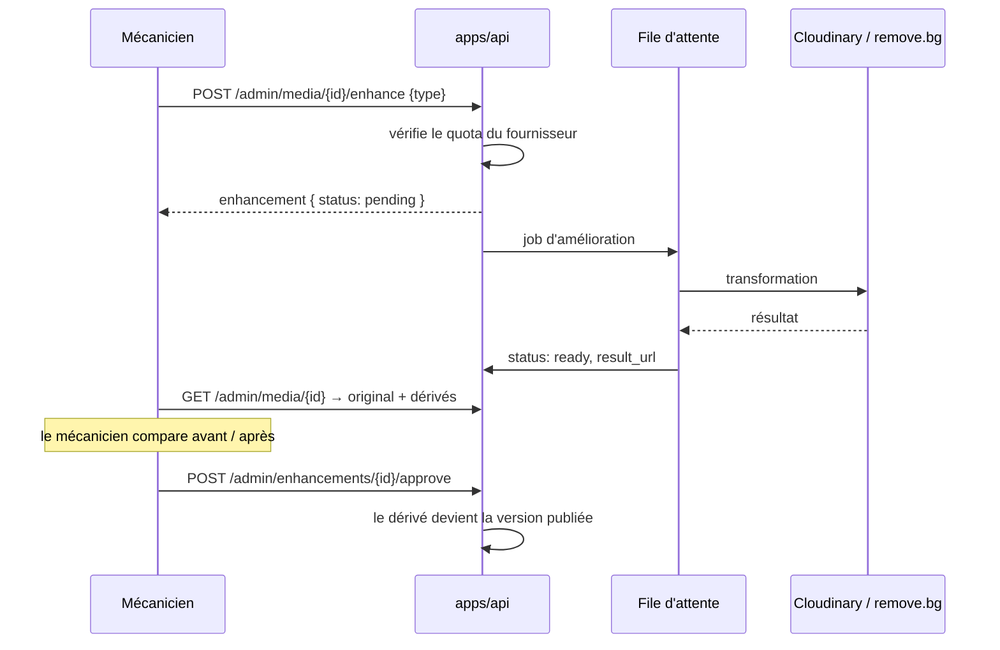

# 01 — Vue d'ensemble

## Le problème à résoudre

Un mécanicien vend des véhicules d'occasion par bouche-à-oreille et réseaux personnels. Il n'a ni vitrine, ni processus. On lui construit une plateforme qui doit réussir **un seul parcours critique** :

> Un acheteur cherche « Toyota Corolla occasion » sur Google → il tombe sur une fiche du garage → il voit de belles photos et un prix → il clique sur WhatsApp → il appelle le mécanicien.

Tout le reste (services, blog, PWA, amélioration des photos) sert ce parcours ou le crédibilise. **Si ce parcours ne fonctionne pas, le projet a échoué**, quel que soit le reste.

Deux conséquences architecturales directes :

1. **Le SEO n'est pas une exigence secondaire, c'est le canal d'acquisition.** D'où le rendu serveur, obligatoire, non négociable.
2. **La qualité perçue des photos est le facteur de conversion.** D'où le pipeline médias, qui est la partie technique la plus riche du projet.

## Contexte système

Points à retenir sur ce schéma :

- Les fichiers médias **ne traversent jamais l'API**. Le backoffice les envoie directement à Cloudinary et R2 avec une signature délivrée par Laravel.
- L'API **appelle** la vitrine (webhook de revalidation), et pas seulement l'inverse. C'est ce qui rend la publication instantanée.
- Facebook est représenté en pointillés : hors V1.

## Conteneurs

| Conteneur | Technologie | Hébergement | Responsabilité |
|---|---|---|---|
| `apps/api` | Laravel 13, PHP 8.4, MySQL 8 | Serveur Excellence Team | Toute la logique métier, la persistance, l'authentification, les intégrations externes, l'orchestration du pipeline médias |
| `apps/web` | Next.js (App Router), React, TypeScript, Tailwind, shadcn/ui | Vercel | Rendu serveur de la vitrine, SEO, cache ISR, PWA (M4) |
| `apps/admin` | Next.js, React, TypeScript, Tailwind, shadcn/ui | Vercel | Interface de gestion, BFF détenant le jeton d'authentification |
| MySQL | MySQL 8 | Serveur Excellence Team | Persistance |
| File d'attente | Pilote `database` (Redis différé, R01) | Serveur Excellence Team | Traitement asynchrone des dérivés de médias |

Les versions exactes sont figées par les fichiers de verrouillage (`composer.lock`, `package-lock.json`). Cette documentation ne les duplique pas.

## Les trois flux qui définissent le système

### Flux 1 — Le visiteur consulte une fiche véhicule

Le point important : dans le cas nominal, **le serveur Laravel n'est pas sollicité du tout**. C'est ce qui rend l'objectif « moins de 3 secondes sur mobile » atteignable indépendamment de la charge du serveur.

### Flux 2 — Le mécanicien publie une annonce avec photos

### Flux 3 — Amélioration d'une photo avec validation (CDC §3.2)

L'original n'est **jamais** écrasé. Un dérivé non approuvé n'est jamais servi au public. C'est ce qui satisfait « visualiser la version originale et la version améliorée avant publication ».

## Frontières de responsabilité

| Question | Réponse |
|---|---|
| Qui décide qu'une annonce est visible ? | L'API. `status` et `published_at` sont métier, jamais dérivés côté front |
| Qui construit le lien WhatsApp ? | L'API renvoie `whatsapp_url` prêt à l'emploi. Le front ne compose pas le message |
| Qui formate un prix ? | Le front. L'API renvoie `price_xaf` en entier, le front l'affiche |
| Qui construit une URL d'image ? | L'API renvoie des URL complètes et les dimensions. Le front ne connaît pas Cloudinary |
| Qui génère un slug ? | L'API, à la création. Immuable ensuite (le SEO en dépend) |
| Qui invalide le cache ISR ? | L'API, par webhook, à chaque changement de donnée publique |
| Qui détient le jeton d'authentification ? | Le BFF de `apps/admin`, en cookie httpOnly. Jamais le code React |

Cette table est la version courte du [contrat frontend / backend](../02-conventions/contrat-frontend-backend.md), qui fait foi.

## Ce que cette architecture coûte

Elle n'est pas gratuite, et il faut en être conscient :

- **Trois bases de code au lieu d'une.** Trois pipelines de déploiement, trois jeux de dépendances.
- **Un contrat à maintenir.** Chaque changement de réponse d'API se propage en trois endroits : `openapi.yaml`, le code Laravel, les types générés côté front.
- **Une couche de proxy en plus.** Le BFF ajoute un saut réseau au backoffice. C'est le prix de la sécurité du jeton.
- **Un cache à invalider.** L'ISR est ce qui rend le site rapide, et c'est aussi la source de bugs la plus subtile du projet : une page périmée est un bug invisible.

En échange : deux devs travaillent en parallèle sans se marcher dessus, le site public est aussi rapide qu'un site statique, et le backoffice peut être refait sans toucher au métier.

## Pour aller plus loin

- [02 — Architecture applicative](02-architecture-applicative.md) — comment chaque app est organisée en interne
- [03 — Modèle de données](03-modele-de-donnees.md)
- [04 — Pipeline médias](04-pipeline-medias.md) — le cœur technique du projet
- [ADR](adr/README.md) — pourquoi ces choix et pas d'autres
