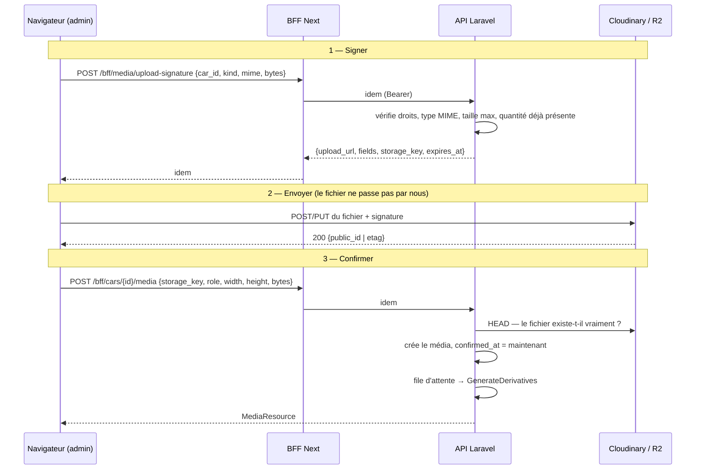
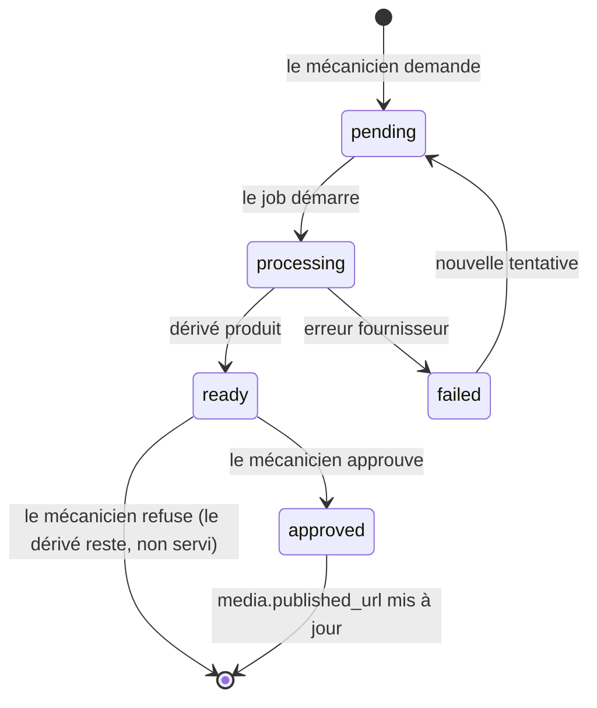

# 04 — Pipeline médias

C'est la partie techniquement la plus riche du projet, et celle qui porte la valeur commerciale : de belles photos vendent des voitures. C'est aussi celle où il y a le plus de manières de se tromper.

Décisions concernées : D06 (photos Cloudinary, vidéos R2), D07 (upload direct signé), D13 (IA photos et quota).

## Trois invariants

Tout ce qui suit en découle. Si un développement les contredit, c'est le développement qui a tort.

1. **L'original n'est jamais modifié ni écrasé.** Toute transformation produit un nouveau fichier.
2. **Un dérivé non approuvé n'est jamais servi au public.** L'approbation est un acte explicite du mécanicien.
3. **Un fichier non confirmé n'existe pas.** Un upload sans appel de confirmation est un orphelin, purgé au bout de 24 h.

## Répartition du stockage

| Type | Fournisseur | Pourquoi |
|---|---|---|
| Photos | **Cloudinary** | Transformations à la volée par URL, WebP/AVIF automatiques, CDN inclus. Le gros du trafic et de la valeur |
| Vidéos | **Cloudflare R2** | Égress gratuit — décisif pour de la vidéo. Aucune transformation, on sert le fichier tel quel |

Rien de lourd ne tourne sur le serveur Excellence Team : Laravel signe, enregistre et orchestre, il ne transcode rien.

---

## Upload : le flux en trois temps

### Pourquoi cette complexité est justifiée

Un upload à travers Laravel serait plus simple à écrire. Il buterait sur `upload_max_filesize`, `post_max_size` et les délais d'expiration PHP dès la première vidéo de 150 Mo, et il ferait passer tout le trafic de fichiers par le serveur. Ici, le serveur ne voit que des métadonnées.

### Le prix à payer : la validation se déplace

Comme le fichier ne traverse pas l'API, on ne peut plus le valider au moment de l'upload. La validation se fait donc **avant** (dans la signature) et **après** (à la confirmation) :

**À la signature** — le mécanicien est-il authentifié ? le `car_id` lui appartient-il ? le type MIME est-il dans la liste blanche ? la taille annoncée respecte-t-elle le maximum ? l'annonce a-t-elle déjà atteint sa limite (2 vidéos) ?

La signature est **restrictive** : Cloudinary et R2 refusent eux-mêmes un fichier qui dépasse la taille signée ou dont le type ne correspond pas au dossier signé. La contrainte est appliquée par le fournisseur, pas seulement annoncée.

**À la confirmation** — un `HEAD` vérifie que l'objet existe réellement, avec la taille et le type attendus. Un client malveillant ne peut pas déclarer un média qu'il n'a pas envoyé.

### Limites

| Type | MIME acceptés | Taille max | Quantité |
|---|---|---|---|
| Photo | `image/jpeg`, `image/png`, `image/webp`, `image/heic` | 15 Mo | illimité par annonce |
| Vidéo | `video/mp4`, `video/quicktime` | 200 Mo | 2 (intérieur, extérieur) |

Ces valeurs vivent dans `config/media.php`, jamais en dur dans le code.

### Purge des orphelins

`PurgeOrphanUploads`, planifié toutes les heures : tout média avec `confirmed_at IS NULL` et créé il y a plus de 24 h est supprimé en base **et chez le fournisseur**. Sans cette purge, chaque upload interrompu consommerait du quota Cloudinary indéfiniment.

---

## Photos : les dérivés

### Dérivés automatiques, sans validation

Générés dès la confirmation, sans intervention du mécanicien. Ce sont des transformations Cloudinary gratuites, purement techniques et non destructives.

| Dérivé | Usage | Transformation |
|---|---|---|
| `thumb` | vignette du backoffice | 200×150, `c_fill`, `f_auto`, `q_auto` |
| `card` | carte du catalogue | 640×480, `c_fill,g_auto`, `f_auto`, `q_auto` |
| `detail` | galerie de la fiche | 1280×960, `c_limit`, `f_auto`, `q_auto` |
| `og` | image de partage | 1200×630, `c_fill,g_auto` |

`f_auto` sert du WebP ou de l'AVIF selon le navigateur, `q_auto` ajuste la compression. Ces deux paramètres à eux seuls font l'essentiel du budget de performance mobile du CDC §4.

Ces dérivés ne passent pas par `media_enhancements` : ce sont des URL calculées, pas des fichiers stockés. On ne conserve rien, on ne compte rien.

### Améliorations soumises à validation (CDC §3.2)

Là, le mécanicien demande, regarde, puis approuve ou non.

| Type | Fournisseur | Coût | Ce que ça fait |
|---|---|---|---|
| `auto_improve` | Cloudinary | gratuit | `e_improve`, `e_auto_contrast`, `e_sharpen` — contraste, lumière, netteté |
| `smart_crop` | Cloudinary | gratuit | `c_fill,g_auto` — recadrage centré sur le véhicule par détection du sujet |
| `background_removal` | **remove.bg** | **quota ~50/mois** | Détourage, puis fond studio uniforme |

L'approbation est le seul moment où `media.published_url` change. Tant que le mécanicien n'a rien approuvé, le public voit l'original. **Il n'y a aucun risque à demander une amélioration** — c'est ce qui rend la fonctionnalité utilisable sans crainte.

### Le quota remove.bg

C'est l'écart E6 au CDC. Le plan gratuit est plafonné et le CDC §4 impose de rester à coût minimal : ces deux exigences sont contradictoires, on livre donc une version comptée.

Mécanique :

1. `RequestEnhancement` vérifie `integration_quotas` pour `(removebg, mois courant)` **avant tout appel réseau**.
2. Si `used >= limit` → `409 Conflict` avec un message explicite. Aucun appel n'est passé, aucun crédit n'est perdu.
3. Sinon, incrément de `used` et création de l'amélioration **dans la même transaction**. Un `SELECT ... FOR UPDATE` évite qu'une double soumission consomme deux crédits pour un seul.
4. Si le job échoue côté fournisseur sans avoir été facturé, le crédit est rendu (`used--`).
5. Le backoffice affiche en permanence « 12 / 50 ce mois-ci », et le bouton se désactive à l'épuisement.

Le compteur est visible **avant** le clic, pas après : le mécanicien doit pouvoir décider s'il dépense un crédit sur cette photo.

---

## Vidéos

Simple, par construction (D06, écart E5) :

1. Upload direct signé vers R2 (PUT présigné).
2. Confirmation, `role` = `video_interior` ou `video_exterior`.
3. Servie telle quelle derrière le CDN Cloudflare, dans un lecteur aux couleurs du garage.

**Aucun réencodage, aucun habillage.** L'habillage publicitaire du Lot 7 exigerait de réencoder — voir [écart E5](../00-contexte/ecarts-cahier-des-charges.md#e5--lhabillage-vidéo-est-reporté-en-v2). Reporté en V2, décision différée R05.

Ce qu'on fait quand même côté front, gratuitement : une vignette d'aperçu (première image, extraite au chargement), un lecteur habillé avec le logo en superposition, `preload="none"` pour ne pas peser sur le budget mobile.

---

## Files d'attente

| Job | Déclencheur | Réessais | Si échec définitif |
|---|---|---|---|
| `GenerateDerivatives` | confirmation d'un média | 3, délai croissant | Le média reste utilisable, l'original est servi |
| `RunEnhancement` | demande d'amélioration | 3 | `status: failed`, crédit rendu, message affiché au mécanicien |
| `RevalidateFrontend` | changement de donnée publique | 5, délai croissant | Le filet ISR d'une heure rattrape |
| `PurgeOrphanUploads` | planifié, chaque heure | — | Journalisé |
| `AggregateCarEvents` | planifié, chaque nuit | — | Journalisé |

Pilote `database` en M0/M1 (décision différée R01), avec un `queue:work` supervisé sur le serveur. Aucun job ne doit dépasser 60 secondes ; s'il le faut, on le découpe.

**Tout job est idempotent.** Un job d'amélioration rejoué ne consomme pas un second crédit : il vérifie d'abord si un résultat existe déjà pour ce `(media_id, type, params)`.

---

## Modes dégradés

Un pipeline qui dépend de trois services externes doit dire ce qui se passe quand ils tombent. Ce tableau fait partie du contrat : le front doit gérer ces cas.

| Panne | Effet | Ce que voit le mécanicien | Ce que voit le visiteur |
|---|---|---|---|
| Cloudinary indisponible à la signature | Upload photo impossible | « Envoi de photos momentanément indisponible, réessayez » | Rien — les photos déjà en ligne sont servies par le CDN |
| Cloudinary indisponible en diffusion | Images non chargées | — | Emplacement réservé, mise en page intacte (`width`/`height` connus) |
| R2 indisponible | Upload vidéo impossible | Message équivalent | Lecteur en erreur, le reste de la fiche fonctionne |
| remove.bg indisponible | `status: failed`, crédit rendu | « Suppression de fond indisponible, votre crédit n'a pas été consommé » | Rien — l'original est servi |
| Quota épuisé | `409` avant tout appel | « Quota mensuel atteint (50/50), disponible le 1er du mois » | Rien |
| Webhook de revalidation en échec | Page publique périmée | Rien de visible — **c'est le plus dangereux** | Une donnée obsolète, jusqu'à 1 h |
| File d'attente arrêtée | Aucun dérivé produit | Améliorations bloquées en `pending` | Originaux servis, site fonctionnel |

Le cas à surveiller est le webhook : c'est le seul dont l'échec est silencieux. D'où le filet ISR d'une heure, et une alerte si `RevalidateFrontend` échoue définitivement.

---

## Ce que le front doit savoir

- L'API renvoie **toujours des URL complètes**. Le front ne construit jamais une URL Cloudinary et ne connaît pas le nom du compte.
- Chaque photo est accompagnée de `width` et `height`. Ils sont **obligatoires** dans le balisage : sans eux, la mise en page saute au chargement et le score de performance s'effondre.
- `published_url` est la version à afficher. `url` est l'original, réservé au backoffice.
- Un média peut n'avoir aucun dérivé prêt : le front affiche l'original, sans état d'erreur.
- Le statut d'une amélioration se consulte par interrogation périodique (toutes les 3 s, abandon au bout de 2 min). Pas de WebSocket, pas de SSE : ce n'est pas justifié pour un utilisateur unique.

Détail des formes de réponse : [`openapi.yaml`](../../openapi.yaml).
