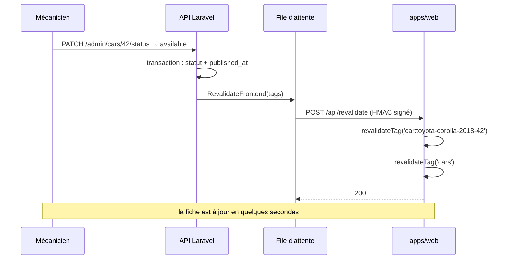

# 07 — Performance, SEO, PWA

Le CDC §4 exige deux choses mesurables : « chargement inférieur à 3 secondes sur connexion mobile standard » et « structure HTML favorisant le SEO ».

Ce ne sont pas des exigences décoratives. **Le SEO est le canal d'acquisition du garage** : si les fiches ne sont pas indexées, la plateforme ne sert à rien. Tout ce document découle de là.

---

## Budget de performance

Cible sur `/voitures/[slug]` — la page qui compte, celle où l'acheteur arrive depuis Google.

| Métrique | Cible | Plafond |
|---|---|---|
| LCP (mobile, 4G) | < 1,8 s | 2,5 s |
| CLS | < 0,05 | 0,1 |
| INP | < 150 ms | 200 ms |
| TTFB (page en cache ISR) | < 200 ms | 500 ms |
| JavaScript envoyé (vitrine) | < 120 Ko compressé | 180 Ko |
| Poids total de la page | < 800 Ko | 1,2 Mo |

Le « moins de 3 secondes » du CDC correspond à peu près à un LCP de 2,5 s sur 4G. On vise nettement en dessous, pour garder de la marge sur une connexion réellement dégradée.

Mesure : Lighthouse CI sur les aperçus Vercel, en mode mobile bridé. Un dépassement du plafond **fait échouer la PR** à partir de M1.

## Comment on tient ce budget

### 1. Rien à calculer au moment de la visite

L'ISR sert de l'HTML pré-rendu depuis le CDN Vercel. Dans le cas nominal, le serveur Laravel n'est **pas sollicité** — la performance du site est donc indépendante de sa charge. C'est la raison principale du choix Next.js (D02).

### 2. Les images sont le poids du site, et on les maîtrise

Une fiche véhicule, c'est huit photos. C'est là que tout se joue.

- `f_auto` : WebP ou AVIF selon le navigateur. Typiquement 30 à 50 % de moins que le JPEG.
- `q_auto` : compression adaptative au contenu.
- Un jeu **fermé** de dérivés (`thumb`, `card`, `detail`, `og`) — pas de largeurs arbitraires, sinon les crédits Cloudinary partent en variantes inutiles.
- `width` et `height` **toujours** présents dans le balisage. C'est ce qui tient le CLS : sans eux, la page saute au chargement des images.
- Chargement paresseux sur toute la galerie **sauf la première image**, qui porte `priority` — c'est elle le LCP.
- Les vidéos en `preload="none"` avec une vignette : une vidéo pré-chargée détruirait à elle seule le budget mobile.

### 3. Presque pas de JavaScript sur la vitrine

Par défaut, tout est Server Component. `"use client"` est réservé à quatre endroits : la galerie, les filtres, le lecteur vidéo, le menu mobile. Chaque nouveau composant client doit se justifier en revue de PR.

Les filtres sont portés par l'URL (`/voitures?marque=toyota&prix_max=5000000`), donc rendus côté serveur : ils fonctionnent sans JavaScript, sont indexables et partageables, et le bouton retour du navigateur les respecte.

### 4. Polices

Une seule famille, deux graisses, en `next/font` (auto-hébergée, `font-display: swap`, préchargée). Aucune requête vers un domaine de polices tiers.

---

## SEO

### Rendu serveur

Chaque page publique est rendue côté serveur avec son contenu réel dans l'HTML initial. Vérification systématique : `curl` sur la page doit montrer le prix, le titre et la description — s'ils ne sont pas là, Google ne les voit pas.

### URL

| Page | URL | Note |
|---|---|---|
| Accueil | `/` | |
| Catalogue | `/voitures` | |
| Fiche | `/voitures/toyota-corolla-2018-42` | **Immuable.** Le slug ne change jamais après création |
| Catalogue filtré | `/voitures?marque=toyota` | Canonique vers `/voitures`, indexable |
| Services | `/services` | |
| Blog | `/blog`, `/blog/{slug}` | |

Les URL sont en français : c'est la langue des recherches des acheteurs.

### Métadonnées

`generateMetadata` par page, alimenté par l'API :

```
Titre    : Toyota Corolla 2018 — 4 500 000 FCFA | Garage X
Descr.   : Toyota Corolla 2018, 85 000 km, essence, boîte automatique.
           Disponible chez Garage X. Contactez-nous sur WhatsApp.
Canonical: https://garage.com/voitures/toyota-corolla-2018-42
OG image : générée par opengraph-image.tsx (photo principale + prix incrusté)
```

L'image Open Graph est ce qui s'affiche quand le mécanicien colle le lien dans WhatsApp ou Facebook. Comme la diffusion sur les réseaux est **manuelle en V1** (écart E4), c'est le seul canal social du projet : elle doit être soignée, ce n'est pas un détail.

### Données structurées

JSON-LD `Vehicle` + `Offer` sur chaque fiche. C'est ce qui permet à Google d'afficher le prix et le kilométrage directement dans les résultats :

```json
{
  "@context": "https://schema.org",
  "@type": "Vehicle",
  "name": "Toyota Corolla 2018",
  "brand": { "@type": "Brand", "name": "Toyota" },
  "modelDate": "2018",
  "mileageFromOdometer": { "@type": "QuantitativeValue", "value": 85000, "unitCode": "KMT" },
  "fuelType": "Essence",
  "vehicleTransmission": "Automatique",
  "offers": {
    "@type": "Offer",
    "price": 4500000,
    "priceCurrency": "XAF",
    "availability": "https://schema.org/InStock",
    "seller": { "@type": "AutoDealer", "name": "Garage X" }
  }
}
```

Une annonce vendue passe en `availability: SoldOut` — Google le comprend et l'affiche, ce qui vaut mieux qu'une page dépubliée (D14).

Également : `AutoRepair` sur `/services` avec adresse et horaires (référencement local, décisif pour un garage), `BlogPosting` sur les articles, `BreadcrumbList` partout.

### `sitemap.xml` et `robots.txt`

`sitemap.ts` génère le plan depuis l'API : toutes les annonces publiées (vendues incluses), les services actifs, les articles publiés, les pages fixes. Régénéré par le webhook de revalidation, donc jamais périmé.

`robots.txt` : tout autorisé sur la vitrine, tout interdit sur le backoffice.

### Pourquoi une annonce vendue reste en ligne

C'est la décision D14, et elle est d'abord une décision SEO. Une fiche accumule de l'autorité sur plusieurs mois. La dépublier revient à jeter ce capital, et à créer une erreur 404 pour tout lien partagé auparavant. Elle reste donc en ligne, avec un badge « Vendu », `availability: SoldOut`, sans bouton WhatsApp, et un appel à l'action vers des véhicules similaires — ce qui transforme une page morte en page d'entrée.

---

## Cache ISR et revalidation

### Le mécanisme



### Ce qui déclenche une revalidation

| Événement | Tags invalidés |
|---|---|
| Création ou modification d'une annonce | `car:{slug}`, `cars` |
| Changement de statut | `car:{slug}`, `cars`, `home` |
| Ajout, suppression, réordonnancement de médias | `car:{slug}` |
| Approbation d'une amélioration | `car:{slug}` |
| Modification d'un service | `services` |
| Publication d'un article | `post:{slug}`, `posts` |
| Modification d'un réglage | `settings`, `home` |

### Le filet de sécurité

Chaque route porte en plus `revalidate = 3600`. Un webhook perdu ne laisse donc pas une page périmée indéfiniment : une heure au pire.

C'est important, parce que **l'échec du webhook est silencieux** : le mécanicien ne voit rien, le visiteur voit une donnée obsolète. C'est le bug le plus subtil de cette architecture, et le filet horaire en limite les dégâts. Une alerte est levée si `RevalidateFrontend` échoue définitivement.

### Ce qu'on ne met jamais en cache

Les route handlers (`/api/*`), tout ce qui est authentifié, et l'intégralité de `apps/admin`.

---

## PWA — M4

Décision D15 : livrée en dernier. La PWA est du confort, pas de la valeur de vente — un acheteur arrive par Google et repart sur WhatsApp, il n'installe pas d'application.

Périmètre de M4 :

- Manifeste (nom, icônes, couleur de thème, `display: standalone`).
- Service worker sur `apps/web` **uniquement** — jamais sur le backoffice.
- Stratégie *stale-while-revalidate* sur le catalogue et les fiches déjà visitées.
- Cache des images en *cache-first*, plafonné à 50 Mo.
- Page hors ligne : « Vous êtes hors connexion » + les dernières annonces consultées.
- Invite d'installation discrète, après deux visites, jamais au premier chargement.

Deux règles fermes :

1. **Le service worker ne met en cache aucune réponse authentifiée.** Le backoffice n'a pas de service worker du tout.
2. **Le service worker ne doit pas servir une annonce vendue comme disponible.** Les réponses en cache portent leur horodatage ; au-delà de 24 h, on force le réseau.

---

## Vérification à chaque jalon

| Jalon | Contrôle |
|---|---|
| M1 | Lighthouse mobile ≥ 90 en performance et SEO sur `/voitures/[slug]`. `curl` montre le prix dans l'HTML. Toutes les images ont `width`/`height` |
| M1 | Revalidation testée de bout en bout : je publie, la page est à jour en moins de 10 s |
| M2 | `sitemap.xml` complet. JSON-LD validé par l'outil de test de Google. Site vérifié dans la Search Console |
| M3 | Le poids des pages ne régresse pas après l'ajout des vidéos |
| M4 | Installable sur Android et iOS. Le catalogue s'ouvre hors connexion. Aucune réponse admin en cache |

Lighthouse CI est branché sur les aperçus Vercel dès M1 et **bloque la PR** en cas de dépassement des plafonds du budget.
