# Étapes et chemin critique

Pas de dates (décision D22). Ce document décrit **l'ordre** et les **dépendances**, pas un calendrier.

Les estimations sont en **jours-homme (j/h)** et servent à comparer les tâches entre elles, pas à promettre une date.

---

## Vue d'ensemble

```mermaid
gantt
    dateFormat X
    axisFormat %s
    title Séquencement par dépendances (unité : jour-homme cumulé)

    section Préalable
    Domaine sur Vercel           :crit, p1, 0, 1
    Serveur, TLS, comptes        :p2, 0, 2

    section M0 Socle
    Contrat santé + auth         :crit, m0a, 1, 1
    API socle + Sanctum          :crit, m0b, after m0a, 3
    Coquilles Next + BFF         :m0c, after m0a, 3
    CI                           :m0d, 1, 2

    section M1 MVP
    Contrat M1                   :crit, m1a, after m0b, 2
    API annonces + médias        :crit, m1b, after m1a, 8
    Front vitrine                :m1c, after m1a, 7
    Front backoffice             :m1d, after m1a, 7
    Revalidation                 :crit, m1e, after m1b, 2
    SEO + perf                   :m1f, after m1c, 3

    section M2
    Services + blog              :m2, after m1e, 8

    section M3
    Vidéos + IA photos           :m3, after m2, 9

    section M4
    PWA + tableau de bord        :m4, after m3, 5
```



---

## Le chemin critique

C'est la chaîne de tâches dont **aucune ne peut être parallélisée**. Tout retard dessus retarde tout.

```
Domaine sur Vercel
  └─▶ Contrat M0 (santé + auth)
        └─▶ API socle + Sanctum
              └─▶ Contrat M1
                    └─▶ API annonces + médias
                          └─▶ Webhook de revalidation
                                └─▶ M1 livrable
```

**Deux observations sur ce chemin.**

D'abord, il commence par une tâche administrative : brancher le domaine sur Vercel. C'est la seule tâche du projet qui ne dépend d'aucun code et qui bloque tout le reste — la configuration des cookies du BFF, les origines CORS et les URL canoniques du SEO en dépendent. **Elle doit être faite le premier jour**, avant même d'écrire une ligne.

Ensuite, **le contrat est sur le chemin critique deux fois**. C'est la contrepartie de la décision D05 : le contrat précède le code. En échange, tout ce qui suit se parallélise — c'est le seul mécanisme qui fait travailler les deux devs simultanément sur une même fonctionnalité.

**Ce qui n'est plus sur le chemin critique :** la validation Meta, qui l'aurait dominé si le Lot 6 était resté en V1. C'est le principal bénéfice de la décision D08.

---

## Étape 0 — Préalable, avant tout code

| # | Tâche | Qui | Bloque |
|---|---|---|---|
| OPS-01 | **Brancher le domaine sur Vercel**, créer les deux projets | Architecture | **tout** |
| OPS-02 | Préparer le serveur : PHP 8.4, MySQL 8, Nginx, Composer, Supervisor | Backend | l'API |
| OPS-03 | TLS de `api.garage.com` (Let's Encrypt, renouvellement auto) | Backend | l'API en ligne |
| OPS-04 | Créer le compte Cloudinary, les dossiers par environnement | Architecture | les médias (M1) |
| OPS-05 | Créer le bucket R2 et le domaine `media.garage.com` | Architecture | les vidéos (M3) |
| OPS-06 | Compte remove.bg, relever le plafond réel du plan gratuit | Architecture | l'IA photo (M3) |
| DEC-01 | **Faire valider les écarts E1 à E7 par le client, par écrit** | Architecture | rien techniquement, **tout contractuellement** |
| DEC-02 | Décider avec le client : lance-t-on la démarche Meta maintenant pour la V2 ? | Architecture | le Lot 6 en V2 |

`DEC-01` ne bloque aucun développement, mais un projet livré en écart d'un document contractuel non amendé est un risque de désaccord en fin de parcours. À traiter tôt, quand c'est encore une discussion et pas un reproche.

---

## Étape 1 — M0, le socle

**Objectif :** la chaîne complète fonctionne, avec un écran vide.

| Ordre | Tâche | Estimation | Dépend de |
|---|---|---|---|
| 1 | Squelette du monorepo, CODEOWNERS, gabarit de PR | 0,5 j | — |
| 2 | CI : commits, Pint, Larastan, ESLint, `tsc` | 1,5 j | 1 |
| 3 | **Contrat : `/health`, `/auth/*`** | 1 j | — |
| 4 | Laravel, MySQL, Sanctum, `users`, `/health`, `/auth/*` | 3 j | 3 |
| 5 | `apps/web` : coquille, jetons Tailwind, shadcn, déploiement | 1,5 j | 1 |
| 6 | `apps/admin` : BFF, connexion, garde serveur, `noindex` | 2,5 j | 3 |
| 7 | Vérification de bout en bout, revue de sécurité M0 | 0,5 j | 4, 6 |

**Parallélisation :** dès que le contrat (3) est fusionné, le backend fait 4 pendant que le frontend fait 5 et 6. Le frontend construit sa page de connexion sur des réponses factices conformes au contrat.

**Piège :** le BFF (6) ne peut être testé réellement qu'avec l'API (4) en place. Le frontend doit donc écrire le BFF avec une réponse factice **puis** revenir le brancher. Prévoir cet aller-retour plutôt que le découvrir.

---

## Étape 2 — M1, le MVP

C'est le gros du projet. Environ 60 % de l'effort du V1.

| Ordre | Tâche | Estimation | Dépend de |
|---|---|---|---|
| 1 | **Contrat M1 complet** : marques, catalogue, fiche, événements, CRUD, médias | 2 j | M0 |
| 2 | Migrations `brands`, `cars`, `media`, `car_events`, `settings` | 1,5 j | 1 |
| 3 | **Factories et seeders réalistes** | 1 j | 2 |
| 4 | Modèles, énumérations, `Photo`/`Video`, contrainte de rôle exclusif | 1,5 j | 2 |
| 5 | Endpoints publics : marques, catalogue avec filtres, fiche, événements | 2,5 j | 4 |
| 6 | Endpoints admin : CRUD annonces, transitions de statut | 2,5 j | 4 |
| 7 | Contrats d'intégration + implémentation Cloudinary + factices | 2 j | 4 |
| 8 | Signature, confirmation, dérivés, purge des orphelins | 3 j | 7 |
| 9 | **Webhook de revalidation, job avec réessais** | 2 j | 5, 6 |
| 10 | Tests Pest + conformité au contrat | 2 j | 5, 6, 8 |
| 11 | Vitrine : accueil, catalogue, filtres dans l'URL | 3 j | 1 |
| 12 | Vitrine : fiche véhicule, galerie, WhatsApp, badge Vendu | 3 j | 1 |
| 13 | Vitrine : SEO, JSON-LD, image OG, `robots.txt`, tags ISR | 2 j | 11, 12 |
| 14 | Backoffice : liste des annonces, filtres, recherche | 1,5 j | 1 |
| 15 | Backoffice : formulaire annonce, validation, transitions | 2,5 j | 1 |
| 16 | **Backoffice : gestionnaire de photos** (dépôt, ordre, principale, upload signé) | 3,5 j | 1 |
| 17 | Lighthouse CI, budget de performance | 1 j | 13 |
| 18 | Vérification manuelle M1, revue de sécurité, déploiement | 1 j | tout |

### La tâche 3 est plus importante qu'elle n'en a l'air

Les factories conditionnent **tout le travail frontend de M1**. Le dev frontend construit sur `migrate:fresh --seed` : si le jeu de données ne contient que des cas parfaits, l'interface cassera en production.

Le seeder doit produire : une annonce vendue, une annonce sans photo, une annonce à 20 photos, une annonce sans description, un prix très élevé et un prix très bas, un modèle au nom très long. Ce sont les cas qui cassent les mises en page.

### La tâche 16 est la plus risquée du projet

Le gestionnaire de photos combine dépôt de fichiers multiples, upload signé en trois temps, barres de progression, réordonnancement, désignation de la photo principale, et gestion d'échec par fichier. C'est l'écran le plus complexe du V1.

**Recommandation : le découper en trois PR** — upload d'un fichier de bout en bout, puis multiple avec progression, puis réordonnancement et photo principale. Une PR unique dépasserait largement la limite de 400 lignes.

### La tâche 9 est le point d'intégration à ne pas sous-estimer

Le webhook traverse les trois applications et un secret partagé. Il faut le tester **de bout en bout, en conditions réelles** — pas seulement en test unitaire — parce que son mode d'échec est silencieux.

C'est un critère de sortie de M1 : *je publie, la page est à jour en moins de 10 secondes*.

---

## Étape 3 — M2, la crédibilité

| Ordre | Tâche | Estimation |
|---|---|---|
| 1 | Contrat M2 : services, articles, réglages | 1 j |
| 2 | Migrations `services`, `posts` + factories | 1 j |
| 3 | API services : CRUD admin + endpoint public | 1,5 j |
| 4 | API articles : CRUD admin + endpoints publics | 2 j |
| 5 | API réglages | 0,5 j |
| 6 | Vitrine : page services | 1,5 j |
| 7 | Vitrine : liste et détail des articles | 2 j |
| 8 | Vitrine : contact, pages légales, fil d'Ariane | 1 j |
| 9 | Vitrine : `sitemap.xml`, JSON-LD `AutoRepair` et `BlogPosting` | 1,5 j |
| 10 | Backoffice : gestion des services, avec désactivation | 1,5 j |
| 11 | Backoffice : rédaction d'articles, écran de réglages | 2 j |
| 12 | **Guide d'utilisation du backoffice** (livrable CDC §6) | 1,5 j |

La tâche 12 est un livrable contractuel, pas une option. Elle est plus facile à écrire maintenant, tant que le produit est frais, qu'en fin de projet.

---

## Étape 4 — M3, la qualité visuelle

| Ordre | Tâche | Estimation |
|---|---|---|
| 1 | Contrat M3 : améliorations, quotas, vidéos | 1 j |
| 2 | Migrations `media_enhancements`, `integration_quotas` | 0,5 j |
| 3 | Intégration R2 : PUT présigné, confirmation, diffusion | 2 j |
| 4 | Améliorations Cloudinary : amélioration auto, recadrage intelligent | 2 j |
| 5 | Intégration remove.bg **avec comptage transactionnel et remboursement** | 2,5 j |
| 6 | Approbation d'un dérivé, bascule de `published_url` | 1 j |
| 7 | Vitrine : lecteur vidéo habillé, vignette | 1,5 j |
| 8 | Backoffice : upload vidéo avec progression | 1,5 j |
| 9 | Backoffice : panneau d'amélioration, comparateur avant/après, interrogation d'état | 3 j |
| 10 | Backoffice : compteur de quota, désactivation à l'épuisement | 1 j |
| 11 | Tests des invariants : quota, approbation, remboursement | 1,5 j |

La tâche 5 est la plus subtile de M3 : le comptage doit être transactionnel (`SELECT ... FOR UPDATE`) pour qu'une double soumission ne consomme pas deux crédits, et le remboursement doit fonctionner en cas d'échec du fournisseur. Un crédit perdu sur 50 par mois, c'est 2 % du quota mensuel.

---

## Étape 5 — M4, le confort

| Ordre | Tâche | Estimation |
|---|---|---|
| 1 | Contrat M4 : tableau de bord | 0,5 j |
| 2 | Agrégation nocturne de `car_events`, purge à 12 mois | 1 j |
| 3 | API tableau de bord | 1 j |
| 4 | Vitrine : manifeste, icônes, service worker, page hors ligne | 2 j |
| 5 | Vitrine : invite d'installation après deux visites | 0,5 j |
| 6 | Backoffice : écran de tableau de bord | 1,5 j |
| 7 | Vérification PWA sur Android et iOS | 0,5 j |

---

## Effort total indicatif

| Jalon | Backend | Frontend | Architecture / OPS | Total |
|---|---|---|---|---|
| Préalable | 1 j | — | 2 j | **3 j** |
| M0 | 3,5 j | 4 j | 2,5 j | **10 j** |
| M1 | 17 j | 16 j | 3 j | **36 j** |
| M2 | 6 j | 8 j | 1,5 j | **15,5 j** |
| M3 | 9,5 j | 7 j | 1 j | **17,5 j** |
| M4 | 2,5 j | 4 j | 0,5 j | **7 j** |
| **V1 complet** | **39,5 j** | **39 j** | **10,5 j** | **89 j** |

**L'équilibre backend / frontend est presque parfait** (39,5 contre 39). Ce n'est pas un hasard : c'est le résultat du découpage par contrat, où chaque fonctionnalité a une moitié de chaque côté. C'est aussi ce qui rend la parallélisation efficace tout du long, sans période où l'un attend l'autre.

Ces chiffres sont des ordres de grandeur pour comparer les jalons entre eux. Ils ne tiennent pas compte des revues, des allers-retours de PR, ni des imprévus — comptez large.

---

## Risques et points de vigilance

| # | Risque | Gravité | Mitigation |
|---|---|---|---|
| R1 | Le domaine n'est pas branché au début | **Élevée** | OPS-01 en tâche zéro. Tout reconfigurer plus tard coûte plusieurs jours |
| R2 | Le webhook de revalidation échoue silencieusement | **Élevée** | Filet ISR d'une heure, alerte sur échec définitif, test de bout en bout obligatoire en M1 |
| R3 | Le gestionnaire de photos dérape en complexité | Élevée | Découper en trois PR. Ne pas viser la perfection d'ergonomie au premier passage |
| R4 | Dérive entre le contrat et le code | Élevée | Test de conformité dès M1, CODEOWNERS sur `openapi.yaml` |
| R5 | Crédits Cloudinary consommés trop vite | Moyenne | Jeu fermé de dérivés, transformations nommées, surveillance mensuelle |
| R6 | Le quota remove.bg s'avère plus bas qu'annoncé | Moyenne | Vérifier le plafond réel en OPS-06, **avant** de promettre la fonctionnalité |
| R7 | Les seeders sont trop propres, le front casse en production | Moyenne | Cas limites explicitement exigés dans la tâche 3 de M1 |
| R8 | Le client refuse un écart au CDC en fin de projet | **Élevée** | DEC-01 traité en préalable, validation écrite |
| R9 | Une branche vit trop longtemps et accumule les conflits | Moyenne | Règle des 3 jours, PR de moins de 400 lignes |
| R10 | Les tests d'upload direct sont difficiles à écrire | Moyenne | Implémentations factices dès la tâche 7 de M1, avant le code d'upload |

**R2, R4 et R8 sont les trois risques structurants** : ils viennent directement des décisions d'architecture, et non de l'exécution. Ils méritent d'être relus à chaque fin de jalon.
